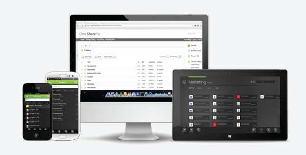

# [ShareFile](https://www.citrix.com/products/sharefile/)

ShareFile is a cloud-based file sharing service that enables users to easily and securely exchange documents.

ShareFile enables users to send large documents by email, securely handle document transfers to third parties, and access a collaboration space from desktops or mobile devices. ShareFile provides users with a variety of ways to work, including a web-based interface, mobile clients, desktop tools, and integration with Microsoft Outlook.

ShareFile is offered under several business plans. ShareFile Enterprise provides enterprise-class service and includes StorageZones Controller and the User Management Tool. Other ShareFile plans are available to fit every company size and budget. For more information, refer to ShareFile [Pricing for Business](https://www.sharefile.com/pricing?src=direct&v=e&cat=1).

# Overview 

This repository serves to index and allows for navigation through the growing content specifically focused on Citrix ShareFile solutions within the [Citrix-TechSpecialist](https://github.com/Citrix-TechSpecialist) GitHub organization. Here you can find tutorials, reference guides and auxiliary tools to better accustom yourself with Citrix ShareFile and how to manage and administer the SaaS based solution. 

# Index

Here is a manually updated list every time a new repository or collateral is published for quick navigation to relevant material. 

## Standard Edition

**[ShareFile-StorageZones](https://github.com/Citrix-TechSpecialist/ShareFile-StorageZones)**

This repository serves as a guide to help prospective customers and partners successfully use an available environment in [Citrix Enablement Center](enablement.citrix.com) to configure an on-premise Citrix ShareFile StorageZone Controller. Though customers do have the option of maintaining their ShareFile Data repository in Citrix-managed cloud storage, customer managed cloud storage (Azure, Amazon, and other S3 sources), this lab is intended to provide hands on experience deploying a Citrix ShareFile StorageZone **on-premises**.
